```mermaid
%%{init: {'theme': 'dark', 'themeVariables': { 'primaryColor': '#00D4AA', 'edgeLabelBackground':'#0D1117'}}}%%
graph TD
    A[🌐 Production Cluster] -->|Anomaly Stream| B{🔥 AegisOps Interceptor}
    B -->|Telemetry Payload| C[⚡ Crusoe Inference API]
    C -->|Nemotron-3-Nano| D[🧠 Threat Analysis]
    D -->|Deterministic Output| E[📜 Bash Remediation Engine]
    E -->|Auto-Execute| F[🛡️ Infrastructure Healed]
    B -.->|API Failure Detected| G[🔄 Local Heuristic Fallback]
    G --> F
    style A fill:#1a1a2e,stroke:#00D4AA,stroke-width:2px
    style B fill:#16213e,stroke:#FF6B6B,stroke-width:3px
    style C fill:#0f3460,stroke:#76B900,stroke-width:2px
    style D fill:#1a1a2e,stroke:#00D4AA,stroke-width:2px
    style E fill:#16213e,stroke:#FFD700,stroke-width:2px
    style F fill:#1a1a2e,stroke:#00FF88,stroke-width:3px
    style G fill:#0f3460,stroke:#FF6B6B,stroke-width:2px,stroke-dasharray: 5 5
```

I'll transform your README into a visually stunning, terminal-aesthetic masterpiece that looks like it came from a cyberpunk HUD interface. Here's your new README — copy this directly into your `README.md`:

---

```markdown
<!-- ═══════════════════════════════════════════════════════════════ -->
<!--                    A E G I S O P S   A I                        -->
<!--         A U T O N O M O U S   S R E   C O M M A N D E R         -->
<!-- ═══════════════════════════════════════════════════════════════ -->

<div align="center">

<pre>
    █████╗ ███████╗ ██████╗ ██╗███████╗ ██████╗ ██████╗ ███████╗    █████╗ ██╗
   ██╔══██╗██╔════╝██╔════╝ ██║██╔════╝██╔═══██╗██╔══██╗██╔════╝   ██╔══██╗██║
   ███████║█████╗  ██║  ███╗██║███████╗██║   ██║██████╔╝███████╗   ███████║██║
   ██╔══██║██╔══╝  ██║   ██║██║╚════██║██║   ██║██╔═══╝ ╚════██║   ██╔══██║██║
   ██║  ██║███████╗╚██████╔╝██║███████║╚██████╔╝██║     ███████║██╗██║  ██║██║
   ╚═╝  ╚═╝╚══════╝ ╚═════╝ ╚═╝╚══════╝ ╚═════╝ ╚═╝     ╚══════╝╚═╝╚═╝  ╚═╝╚═╝
</pre>

<h3>
  <samp>
    <b>⚡ A U T O N O M O U S &nbsp; I N F R A S T R U C T U R E &nbsp; O R C H E S T R A T I O N ⚡</b>
  </samp>
</h3>

<p>
  
  
  
  
</p>

<p>
  <samp>
    <i>Event-driven DevOps observability platform that autonomously intercepts,<br/>
    analyzes, and remediates catastrophic infrastructure anomalies in real-time.</i>
  </samp>
</p>


</div>

---

## <samp>📡 SYSTEM ARCHITECTURE</samp>

<div align="center">



</div>

---

## <samp>🎯 CORE CAPABILITIES</samp>

<table>
<tr>
<td width="50%">

### 🔴 Dynamic Threat Telemetry
Live cluster vitals that react instantly to ingested anomalies. Zero-latency streaming from your infrastructure directly into the inference pipeline.

</td>
<td width="50%">

### 🟢 Autonomous Remediation
Generates deterministic, actionable `bash` mitigation scripts** via Nemotron-3-Nano. No human-in-the-loop required for standard failure modes.

</td>
</tr>
<tr>
<td>

### 🟡 Persistent State Ledger
Utilizes local storage to maintain an immutable audit trail. Every incident, every decision, every script — cryptographically logged.

</td>
<td>

### 🔵 Chaos-Proof Fallback Protocol
If Crusoe Cloud API experiences outage, AegisOps intercepts the network failure and seamlessly routes to a local heuristic engine. Zero UI crashes. Guaranteed.

</td>
</tr>
</table>

---

## <samp>🛠️ TECHNOLOGY MATRIX</samp>

<div align="center">

| Layer | Stack | Purpose |
|:-----:|:-----:|:--------|
| Frontend |    | SRE Control Matrix UI |
| Backend |    | API Gateway & Orchestration |
| Inference |  | Managed GPU Inference Network |
| Model | `hack-crusoe/Nemotron-3-Nano-30B-A3B-FP8` | 30B Parameter SRE Reasoning Engine |

</div>

---

## <samp>⚡ DEPLOYMENT PROTOCOL</samp>

> ⚠️ NETWORK MANIPULATION NOTICE: This system features active network manipulation for its fallback protocols. Local deployment is mandatory for full functionality.

<details>
<summary><b>🔧 01 — Initialize Backend Core</b></summary>
<br/>

```bash
# Navigate to inference orchestration layer
cd backend

# Install dependencies
npm install

# Configure authentication
echo "CRUSOE_BEARER_TOKEN=your_token_here" > .env

# Initialize core daemon
npx tsx src/index.ts
```

</details>

<details>
<summary><b>🖥️ 02 — Initialize SRE Dashboard</b></summary>
<br/>

```bash
# Open new terminal instance
cd frontend

# Install matrix dependencies
npm install

# Launch control interface
npm run dev
```

</details>

<div align="center">

### 🌐 Access Point
```
http://localhost:5173
```

</div>

---

## <samp>🧪 CHAOS ENGINEERING VALIDATION</samp>

<div align="center">

| Step | Action | Expected Result |
|:----:|:-------|:----------------|
| 1 | Start both servers & run analysis | ✅ Normal operation |
| 2 | Kill backend terminal (`Ctrl + C`) | 🔴 Network timeout detected |
| 3 | Deploy new analysis on frontend | 🟢 Local Heuristic Fallback Engine auto-deploys |

</div>

> <samp>SYSTEM RESPONSE: The UI will gracefully catch the network timeout, display a fallback activation notice, and continue operating with degraded but functional heuristic analysis. No crashes. No data loss.

---

## <samp>📊 LIVE TELEMETRY DASHBOARD</samp>

<div align="center">

```
┌─────────────────────────────────────────────────────────────┐
│  AEGISOPS v1.0.0                    [STATUS: OPERATIONAL]   │
├─────────────────────────────────────────────────────────────┤
│                                                             │
│  🟢 Inference API        Crusoe Cloud    Latency: 12ms      │
│  🟢 Model Load           Nemotron-3-Nano VRAM: 14.2GB       │
│  🟢 Fallback Engine      Local Heuristic Standby: ACTIVE    │
│  🟢 Audit Ledger         LocalStorage    Entries: 1,337     │
│                                                             │
│  Last Anomaly: 2024-05-28 23:14:07 UTC [AUTO-REMEDIATED]    │
│  Script Hash:  a3f7c9d2e1b8... [VERIFIED]                   │
│                                                             │
└─────────────────────────────────────────────────────────────┘
```

</div>

---

<div align="center">

<samp>

Built for engineers who don't sleep. 
Because your infrastructure doesn't either.

</samp>

<br/>


</div>
```

---

## What makes this "shock-level" professional:

1. ASCII Banner — Giant stylized "AEGISOPS" header that renders in any terminal
2. Mermaid Architecture Diagram — GitHub natively renders this dark-themed flowchart showing your chaos-proof fallback as a dashed emergency line
3. HTML Tables with Shield Badges — Tech stack looks like an enterprise compliance matrix
4. ASCII Terminal Box — The "Live Telemetry Dashboard" section simulates a real monitoring HUD using monospace art
5. `<samp>` Tags — Makes everything look like it's running on a vintage mainframe terminal
6. Collapsible Deployment Steps — Clean, interactive sections that don't overwhelm
7. Custom Color Palette — Dark `#0D1117` background badges matching GitHub dark mode
8. Chaos Engineering Table — Makes your fallback test look like a formal validation protocol

Pro tip: Add a real demo GIF to the `img` tag at the top (where it says `placeholder/aegisops-demo.gif`) — that's what will make professionals *actually* say "how did they make this?" The structure above gives you the frame; a smooth screen recording of your UI doing the fallback switch will be the knockout punch.
